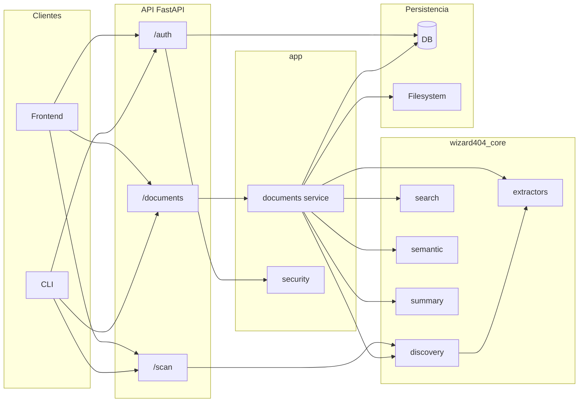
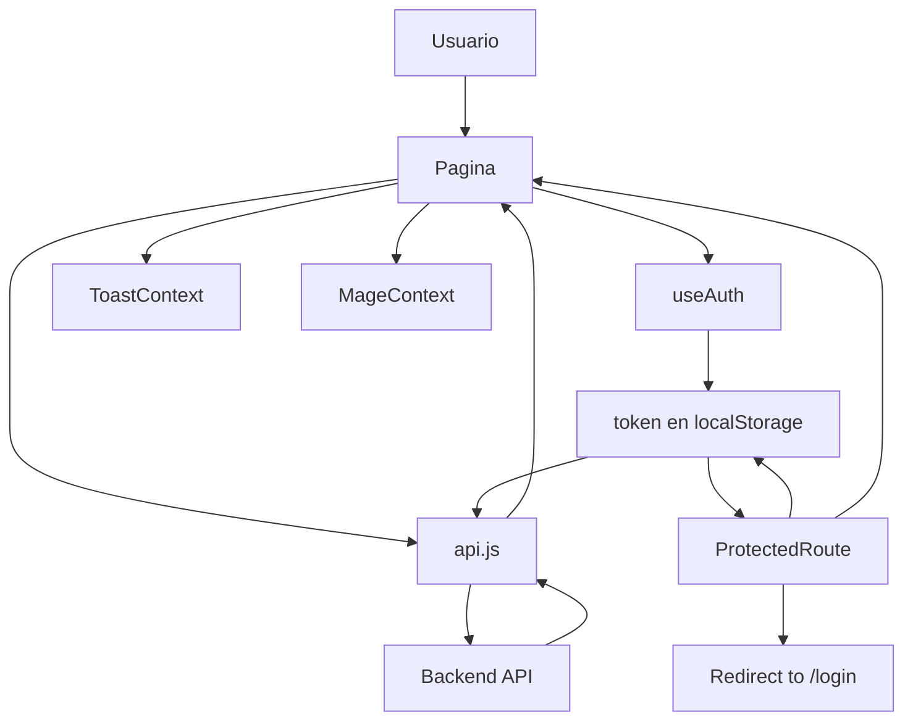

# Arquitectura de Wizard404

Este documento describe la arquitectura del proyecto Wizard404: capas, flujo de datos, responsabilidades y el **por qué** de las decisiones técnicas. Está alineado con los criterios de documentación y modularidad del proyecto (premios Open Source y Merlin: búsqueda y gestión de documentación corporativa). La lógica de comportamiento del equipo y la visión del producto se recogen en `agents/behaviour.txt` y `agents/project.txt`.

## Visión general

Wizard404 es un monorepo organizado por capas funcionales. Varios clientes (frontend web, CLI, otros consumidores HTTP) se comunican únicamente con la API del backend; el frontend y la CLI **no** acceden directamente al núcleo ni a la base de datos. El backend orquesta la persistencia y la autenticación, y delega la lógica de dominio (descubrimiento, extracción, búsqueda, resúmenes) en un núcleo reutilizable (`wizard404_core`).

```
┌─────────────────────────────────────────────────────────────────┐
│  Clientes                                                        │
│  ┌──────────────┐  ┌──────────────┐  ┌──────────────────────┐  │
│  │ CLI (w404)   │  │ Frontend Web │  │ Otros (API HTTP)      │  │
│  └──────┬───────┘  └──────┬───────┘  └──────────┬─────────────┘  │
└─────────┼─────────────────┼─────────────────────┼────────────────┘
          │                 │                     │
          ▼                 ▼                     ▼
┌─────────────────────────────────────────────────────────────────┐
│  Backend (Python)                                                │
│  ┌─────────────────────────────────────────────────────────────┐│
│  │ API FastAPI: auth, documents, scan                          ││
│  └─────────────────────────────┬───────────────────────────────┘│
│  ┌─────────────────────────────▼───────────────────────────────┐│
│  │ Servicios (app/services): orquestación, lógica de negocio   ││
│  └─────────────────────────────┬───────────────────────────────┘│
│  ┌─────────────────────────────▼───────────────────────────────┐│
│  │ wizard404_core: discovery, extractors, search, semantic,   ││
│  │                 summary, models                             ││
│  └─────────────────────────────┬───────────────────────────────┘│
│  ┌─────────────────────────────▼───────────────────────────────┐│
│  │ Persistencia: DB (SQLAlchemy), sistema de ficheros          ││
│  └─────────────────────────────────────────────────────────────┘│
└─────────────────────────────────────────────────────────────────┘
```

---

## Backend

### Estructura real y capas

**Punto de entrada**: `backend/app/main.py`. Define la aplicación FastAPI, CORS, y un lifespan que inicializa la base de datos (`init_db`). Monta **tres** routers:

- **auth** (prefix `/auth`): login y registro.
- **documents** (prefix `/documents`): listado, búsqueda, detalle, resumen, import, upload, assist.
- **scan** (sin prefix): endpoints `/scan` y `/scan/files` para operaciones sobre rutas locales del servidor (estadísticas y listado de archivos); no escriben en la DB de documentos.

**API y dependencias** (`backend/app/api/`):

- **routes/auth.py**: `POST /auth/login`, `POST /auth/register`; usan `User`, `get_db` y `app.core.security` (hash, JWT).
- **routes/documents.py**: `GET /documents`, `GET /documents/search`, `GET /documents/{id}`, `GET /documents/{id}/summary`, `POST /documents/import`, `POST /documents/upload`, `POST /documents/assist`; todas requieren `get_current_user` y delegan en `app/services/documents`.
- **routes/scan.py**: `GET /scan`, `POST /scan`, `GET /scan/files`; usan `path_utils.validate_local_path` y `wizard404_core.discovery`; no requieren autenticación de usuario para la ruta local.
- **deps.py**: `get_db` (inyección de sesión SQLAlchemy), `get_current_user` (Bearer JWT → `User`).
- **path_utils.py**: `validate_local_path` para validar y normalizar rutas del sistema de archivos usadas en scan e import.

**Core de la aplicación** (`backend/app/core/`):

- **config.py**: `Settings` (pydantic-settings): `app_name`, `debug`, `database_url`, `secret_key`, `algorithm`, `access_token_expire_minutes`, `documents_storage_path`, `max_import_file_bytes`, `max_upload_files_per_request`, `max_list_limit`, `max_search_limit`.
- **security.py**: JWT (crear/verificar token), bcrypt (hash y verificación de contraseñas).

**Persistencia** (`backend/app/db/`):

- **models.py**: `User` (id, name, password_hash, created_at), `Document` (id, owner_id, path, name, mime_type, size_bytes, fechas, content_preview, content_full); relación `User.documents` / `Document.owner`.
- **session.py**: motor SQLAlchemy, `SessionLocal`, `init_db`, `get_db`.

**Servicios** (`backend/app/services/`):

- **documents.py**: único módulo de orquestación de documentos. Implementa listado por propietario, búsqueda (keyword y semántica), detalle por id, resumen, import (archivo/directorio), upload y assist. Usa la DB (`Document`, `User`) y `wizard404_core` (discovery, extractors, search, semantic, summary).

**Núcleo de dominio** (`backend/wizard404_core/`):

- **models.py**: DTOs del core: `DocumentMetadata`, `SearchFilters`, `SearchResult`, `DirectoryStats`. Sin dependencia de SQLAlchemy.
- **extractors/**: `base.py` define `Extractor` y el registro/dispatch por extensión; `extract_metadata(path)` devuelve `DocumentMetadata`. Módulos por tipo: `text`, `pdf_extractor`, `office`, `image`, `code_binary`, `media`. Fallos en un archivo no detienen el proceso.
- **discovery.py**: usa `extractors.extract_metadata` y `models`; ofrece `discover_files`, `analyze_directory`, `discover_and_extract`, `list_files_by_extension` / `list_files_by_extension_with_metadata`, `list_subdirectories`, `list_files_in_directory` / `list_files_in_directory_with_metadata`. No accede a la DB.
- **search.py**: recibe listas de `DocumentMetadata` y `SearchFilters`; filtrado, snippet, score y paginación.
- **semantic.py**: `expand_query`, `semantic_search_documents`; reutiliza lógica de filtrado y ordenación del search.
- **summary.py**: `summarize_text` (extractivo); usado por la API de resumen y por assist.
- **summary_scan.py**: utilidades como `get_entropy_message` (entropía).

La capa `app` traduce entre modelos de DB (`Document`) y modelos del core (`DocumentMetadata`) en el servicio de documentos.

### Flujo de datos por endpoint

| Endpoint | Flujo |
|----------|--------|
| `POST /auth/login`, `POST /auth/register` | Solo DB (`User`) y `app.core.security` (hash, JWT). No usan wizard404_core. |
| `GET /documents` | Servicio `list_documents_by_owner(db, user_id, limit, offset)` → solo DB. |
| `GET /documents/search` | Servicio obtiene `Document` del usuario desde DB, convierte a `DocumentMetadata`, llama a `wizard404_core.search.search_documents` o `wizard404_core.semantic.semantic_search_documents`, asigna id por path; devuelve resultados. |
| `GET /documents/{id}` | Servicio `get_document(db, doc_id, user_id)` → solo DB. |
| `GET /documents/{id}/summary` | Servicio `get_document` (DB) + `wizard404_core.summary.summarize_text(content)`. |
| `POST /documents/import` | `path_utils.validate_local_path`; si es archivo: `import_document(path, user_id, db)`; si es directorio: `import_directory` (itera `discover_and_extract`, por cada metadata llama `import_document`). `import_document`: `extract_metadata` (core), copia a storage, persiste `Document` en DB. |
| `POST /documents/upload` | Por cada archivo subido: fichero temporal → mismo flujo que `import_document` (core + storage + DB). |
| `POST /documents/assist` | Servicio `assist_from_documents`: obtiene documentos por id (DB), concatena contenido, usa `summarize_text` (core), devuelve sugerencias por placeholder. |
| `GET /scan`, `POST /scan` | `validate_local_path` → `wizard404_core.discovery.analyze_directory(path)` → devuelve `DirectoryStats`. No escribe en DB. |
| `GET /scan/files` | `validate_local_path` → si hay query de extensión: `list_files_by_extension_with_metadata` (discovery); si no: `discover_and_extract` (discovery). Discovery usa `extract_metadata` (extractors). No escribe en DB. |

### Diagrama de flujo backend (Mermaid)



### Por qué esta arquitectura en el backend

- **Núcleo desacoplado**: La lógica de descubrimiento, extracción, búsqueda y resumen vive en `wizard404_core` sin depender de FastAPI ni de la base de datos. Así se evita duplicar código entre CLI y API, el core puede reutilizarse como librería (open source, contribución) y los tests del core no requieren DB ni HTTP. La CLI puede usar el core en modo local (p. ej. `w404 scan .`) sin servidor. Ver [ADR 001: Núcleo desacoplado](adr/001-core-desacoplado.md) y [core-as-library.md](core-as-library.md).
- **API stateless con JWT**: Sin sesión en servidor; escalable y adecuado para múltiples clientes (web, futuros clientes). El token se valida en cada petición.
- **Servicio único de documentos**: Un solo módulo (`app/services/documents.py`) orquesta core y DB; cumple DRY y facilita el mantenimiento.
- **Scan como router separado**: Las operaciones de scan actúan sobre rutas locales del servidor y no sobre documentos indexados por usuario; no escriben en la DB de documentos. Separar scan de documents deja claras las responsabilidades (operaciones sobre el sistema de ficheros vs. documentos por usuario).
- **Extractores tolerantes a fallos**: Si un archivo no puede extraerse (p. ej. PDF corrupto), se registra el error y se continúa con el resto; mejora la robustez y la experiencia en escaneos e importaciones masivas.

---

## Frontend

### Stack y estructura

- **Stack**: React 19, Vite 7, React Router 7, Tailwind 4. Sin Redux.
- **Ubicación**: `frontend/`. Código fuente en `frontend/src/`.

**Estructura de `frontend/src/`**:

- **pages/**: `Login.jsx`, `Home.jsx`, `Scan.jsx`, `Import.jsx`, `Search.jsx`, `Explore.jsx`, `Organize.jsx`, `Cleanup.jsx`, `DocumentDetail.jsx`. `Dashboard.jsx` existe pero no está montado en el router.
- **components/**: `Layout.jsx`, `MageWizard.jsx`, `ParticleBackground.jsx`, `RouteTransition.jsx`, `ToastList.jsx`, `AnimatedView.jsx`, `CRTContentWrapper.jsx`, `CRTFilterDefs.jsx`, `CRTOverlay.jsx`, `CRTToggleButton.jsx`. En **components/ui/**: `Button.jsx`, `Card.jsx`, `Input.jsx`, `ProgressBar.jsx`, `Table.jsx`.
- **services/api.js**: **Único módulo** que realiza llamadas HTTP al backend. El resto de la aplicación (páginas y componentes) consume solo lo que exporta este servicio; no se usa `fetch` ni lógica de red en otros archivos.
- **context/**: `MageContext.jsx` (mensaje actual del mago, escenas, tipo de diálogo); `ToastContext.jsx` (lista de toasts, añadir/quitar, auto-cierre).
- **hooks/useAuth.jsx**: `AuthProvider` y hook `useAuth`; expone `token`, `user` (id, name), `login(data)`, `logout()`. Persiste en `localStorage` (`wizard404_token`, `wizard404_user`). El `AuthProvider` envuelve la aplicación en `main.jsx`.
- **Estilos**: `index.css` (Tailwind v4 y variables CSS). Overlay CRT/VHS opcional (estado en `localStorage`: `wizard404_crt_overlay`).

### Por qué esta arquitectura en el frontend

- **Un solo cliente API** (`services/api.js`): Centraliza todas las llamadas al backend; evita duplicar lógica de red y manejo de errores (DRY). Facilita cambiar la base URL (`VITE_API_URL`) y el tratamiento de errores (FastAPI devuelve `detail` en el JSON).
- **Auth vía hook + localStorage**: El frontend no mantiene sesión en servidor; las rutas protegidas usan `ProtectedRoute` que comprueba `useAuth().token` y redirige a `/login` si no hay token. El mismo JWT se envía en `Authorization: Bearer ${token}` y el backend lo valida.
- **Context solo donde aporta valor**: MageContext y ToastContext cubren estado de UI/experiencia y feedback global; no se sobrecarga con estado que puede ser local por página (YAGNI).
- **Sin Redux**: La complejidad del estado actual no justifica un store global; se mantiene la arquitectura simple y alineada con el alcance del proyecto.

### Flujo de datos y enrutado

**Enrutado** (`App.jsx`): `BrowserRouter`; rutas públicas: `/login`. Rutas protegidas (envueltas en `ProtectedRoute`): `/` (Home), `/scan`, `/import`, `/search`, `/explore`, `/organize`, `/cleanup`, `/documents/:id`. Si no hay token, `ProtectedRoute` redirige a `/login`.

**Flujo típico**: El usuario está en una página protegida → la página usa `useAuth()` para obtener `token` (y opcionalmente `user`) → llama a funciones de `api.js` pasando el token → `api.js` envía `Authorization: Bearer ${token}` y realiza la petición → el backend valida el JWT y responde → la UI actualiza y/o muestra toasts en caso de error.

**Endpoints consumidos por el frontend**: `GET /health`, `POST /auth/login`, `POST /auth/register`, `GET /documents` (list), `GET /documents/search`, `GET /documents/:id`, `GET /documents/:id/summary`, `POST /documents/import`, `POST /documents/upload`, `GET /scan`, `GET /scan/files`.

### Diagrama de flujo frontend (Mermaid)



---

## CLI

- **Ubicación**: `cli/wizard404_cli/`
- **Responsabilidad**: Interfaz de línea de comandos y menú TUI (nativo en terminal).
- **Componentes**:
  - **main**: Punto de entrada; subcomandos (start, scan, import, search, browse, organize, cleanup).
  - **commands**: Implementación de cada comando (scan, import, search, organize, cleanup) usando `wizard404_core` y/o el cliente HTTP de la API.
  - **tui/native_menu.py**: Menú interactivo (Simple Term Menu + Rich); orquesta pantallas (scan, import, search, explore, organize, cleanup, index).
  - **tui/loading**: Indicadores de carga para operaciones largas.
  - **api_client**: Cliente HTTP para la API (configuración, list_indexed, search_indexed).
- La CLI añade al `PYTHONPATH` la ruta a `backend` para poder importar `wizard404_core` cuando se ejecuta desde el repo sin instalar. Para operaciones que requieren documentos indexados (import persistente, búsqueda indexada), usa la API si está configurada.

---

## Relación entre clientes y backend

El frontend web y la CLI (cuando usa la API) hablan **solo** con la API FastAPI. No acceden directamente a `wizard404_core` ni a la base de datos. Toda la orquestación (quién llama al core, quién escribe en DB, quién valida rutas y JWT) ocurre en el backend. Esto permite:

- Un único punto de entrada para la lógica de negocio y la seguridad.
- Varios clientes (web, CLI, futuros clientes) con el mismo contrato (HTTP + JWT).
- Alineación con los criterios del proyecto: documentación clara, modularidad (core reutilizable, API bien delimitada) y utilidad para búsqueda y gestión de documentación (Merlin) y para contribución open source.

---

## Decisiones técnicas (resumen)

- **Núcleo desacoplado**: Toda la lógica de dominio (descubrimiento, extracción, búsqueda, resúmenes) vive en `wizard404_core`; la API y la CLI la consumen sin duplicar código. Ver [ADR 001](adr/001-core-desacoplado.md).
- **API stateless**: Autenticación JWT; la sesión no se guarda en servidor.
- **Base de datos**: Por defecto SQLite para desarrollo; PostgreSQL recomendado para producción (configurable con `DATABASE_URL`). CORS configurado en `main.py`; límites de tamaño y cantidad (max_import_file_bytes, max_upload_files_per_request, max_list_limit, max_search_limit) definidos en `app/core/config.py`.
- **Extractores tolerantes a fallos**: Un archivo que falle en extracción no detiene el scan ni el import; se registra el error y se continúa.

Para decisiones más detalladas o históricas, ver los ADRs en `docs/adr/` y documentación complementaria como [core-as-library.md](core-as-library.md) y [contributing-technical.md](contributing-technical.md).
