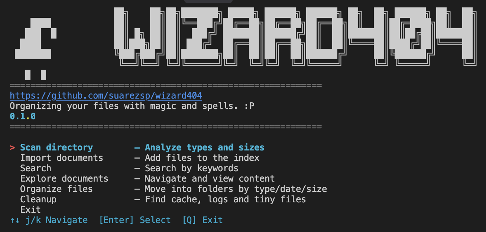
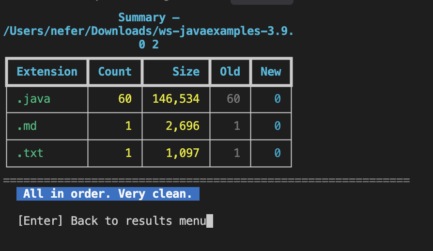

<div align="center">


# Wizard404

### Поиск и управление документами — CLI + Web

**Сканировать · Импорт · Поиск · Обзор · Организация · Очистка.**  
Одна кодовая база. Один API. Терминал и браузер. Документы под контролем.

[Документация](../) · [Быстрый старт](#быстрый-старт) · [Участие](../../CONTRIBUTING.md)

**Читать на:** [English](../../README.md) · [Español](README.es.md) · [Polski](README.pl.md) · [中文](README.zh.md) · [Русский](README.ru.md) · [Deutsch](README.de.md)

[](https://python.org)
[](https://fastapi.tiangolo.com)
[](https://react.dev)
[](https://vitejs.dev)
[](https://tailwindcss.com)
[](https://sqlite.org)

**MIT** · Python · FastAPI · React · CLI + Web

</div>

---

> **Wizard404** объединяет поиск и управление документами (PDF, текст, Office, изображения, аудио, видео): сканирование каталогов, импорт в индекс, поиск по содержимому и просмотр из CLI или веб-интерфейса. Для небольших команд, компаний с разрозненными документами и разработчиков, использующих ядро (`wizard404_core`) как библиотеку.

---

## Что такое Wizard404?

Wizard404 — **платформа с открытым исходным кодом для поиска и управления документами** — не просто проводник файлов. Это полный стек: переиспользуемое **ядро** на Python, **REST API** (FastAPI), интерактивный **CLI** (w404) и **веб-приложение** (React) с теми же возможностями.

Обычные инструменты заставляют открывать каждый файл. Wizard404 **индексирует содержимое**: вы ищете по ключевым словам, фильтруете по типу или размеру и переходите к нужному документу. Можно сканировать папку, смотреть статистику по расширениям и энтропии, организовывать файлы по типу/дате/размеру и очищать кэши и логи — из терминала или из браузера.

Вся система по умолчанию работает на **SQLite**. Один бэкенд, одна команда для запуска.

```bash
# CLI — меню в 2 команды
./w404

# Web — бэкенд + фронтенд
./run-dev.sh
# API: http://localhost:8000 · Приложение: http://localhost:5173
```

---

## Превью

| CLI — Главное меню | Результаты сканирования — Энтропия и по расширению |
|-------------------|-----------------------------------------------------|
|  |  |

*Слева: Главное меню (Сканировать, Импорт, Поиск, Обзор, Организация, Очистка). Справа: Результаты сканирования с итогом по расширению и энтропии.*

---

## Что можно делать

| Функция | CLI | Web | Описание |
|--------|-----|-----|----------|
| **Сканировать каталог** | Да | Да | Анализ типов, размеров, расширений; сводка по энтропии; детализация по расширению. |
| **Импорт документов** | Да | Да | Добавление файлов в индекс (путь или «Выбрать папку» в Chrome/Edge). |
| **Поиск** | Да | Да | Ключевые слова в каталоге или в проиндексированных документах; фильтры и семантика. |
| **Обзор / Индекс** | Да | Да | Список проиндексированных документов; просмотр деталей и сводки. |
| **Организация** | Да | Нет | Перемещение файлов в папки по типу, дате или размеру. |
| **Очистка** | Да | Нет | Поиск кэша, логов, мелких файлов; безопасное удаление. |

*Импорт и просмотр индекса удобнее выполнять из **веба** (Обзор + Импорт). CLI перенаправляет в приложение для единого опыта.*

---

## Какую задачу решает

- **Найти документы по содержимому** — Искать контракты, отчёты или предложения по ключевому слову без открытия каждого PDF или Office-файла.
- **Упорядочить загрузки и папки** — Сортировка по типу, дате или размеру (Организация); обнаружение кэша и временных файлов (Очистка).
- **Одно место для поиска** — Сканировать каталоги, импортировать в индекс и искать на диске или в индексе из CLI или веба.

---

## Архитектура

Монорепозиторий по слоям: ядро, API, CLI, фронтенд.

```
backend/          Приложение FastAPI, auth, health, config
  app/            Маршруты (auth, documents, scan), сервисы, БД
  wizard404_core  Discovery, экстракторы (PDF, Office, текст, изображения, медиа), поиск, семантика, сводка
cli/              w404 — TUI-меню и прямые команды (scan, import, search, organize, cleanup)
frontend/         React + Vite + Tailwind — UI в стиле 16-bit, Scan, Import, Search, Explore, детали документа
docs/             Архитектура, участие, доступ к каталогам в вебе, ядро как библиотека
```

---

## Быстрый старт

### 1. Клонирование и требования

- **Python 3.10+**
- **Node 18+** (опционально, для фронтенда)
- **SQLite** (по умолчанию; опционально PostgreSQL)

```bash
git clone <url-репозитория>
cd wizard404
```

### 2. Бэкенд

```bash
cd backend
python -m venv venv
source venv/bin/activate   # Windows: venv\Scripts\activate
pip install -r requirements.txt
uvicorn app.main:app --reload
```

Опционально: `python -m scripts.seed_admin` для пользователя по умолчанию. API: **http://localhost:8000**, документация API: **http://localhost:8000/docs**.

### 3. CLI (w404)

Из корня репозитория:

```bash
./w404
```

Открывается интерактивное меню. Если бэкенд не запущен, CLI может его запустить и задать токен по умолчанию (пользователь `w404` / `w404`). Далее: **Сканировать каталог**, **Импорт документов**, **Поиск**, **Обзор**, **Организация**, **Очистка**.

Прямые команды:

```bash
./w404 scan .
./w404 import docs/
./w404 search контракт --path docs/
./w404 organize /path -d ~/Desktop/Organized --by type
./w404 cleanup /path --dry-run
```

### 4. Web (бэкенд + фронтенд)

Из корня репозитория:

```bash
./run-dev.sh
```

Бэкенд в фоне, фронтенд на переднем плане. Приложение: **http://localhost:5173**. При первом запуске: установите venv бэкенда и `frontend/node_modules` (шаги 2 и `cd frontend && npm install`).

---

## Аудитория

- **Небольшие команды и компании** с документами, разбросанными по папкам и почте.
- **Разработчики**, желающие использовать ядро как библиотеку — см. [Использование ядра как библиотеки](../core-as-library.md).

---

## Разработка

```bash
# Тесты бэкенда
cd backend && source venv/bin/activate && pytest tests -v

# Тесты фронтенда
cd frontend && npm run test

# Линт / форматирование по проекту (backend: ruff/black; frontend: eslint/prettier)
```

---

## Лицензия

MIT. См. [LICENSE](../../LICENSE).

---

## Участие в разработке

Мы хотим, чтобы вклад был простым. См. [руководство по участию (CONTRIBUTING.md)](../../CONTRIBUTING.md) по настройке, стандартам кода и процессу. Идеи — в issue или в «Good First Issues» в CONTRIBUTING. Кодекс поведения: [CODE_OF_CONDUCT.md](../../CODE_OF_CONDUCT.md).

---

<div align="center">

**Wizard404** — Python · FastAPI · React · Vite · Tailwind · CLI + Web

</div>
